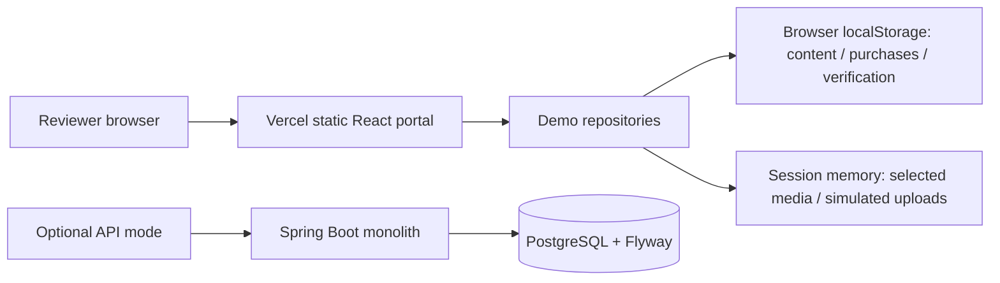
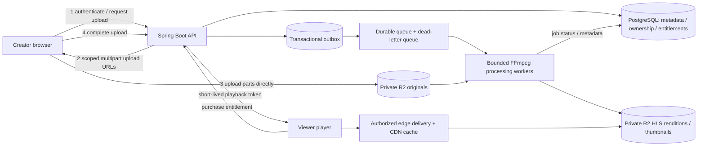

# CreatorHub technical design

## Implemented assessment application

React, TypeScript, Vite, Tailwind CSS, Lucide icons and Recharts provide the
responsive portal. Pages compose organisms, molecules and atoms. Feature
repositories separate data access from forms and presentation. Zod validates
inputs and stored data; money uses integer USD cents.

The live deployment uses explicit `VITE_DEMO_MODE=true`: a synthetic creator
opens directly, content and verification use account-scoped localStorage, and
files remain in browser memory. There is no API traffic or real authentication.
Synthetic analytics are demonstrations, not financial records. The dashboard
purchase fixture and per-content analytics simulator are independent; their
revenue totals are not a reconciled ledger.

The separate API implementation is a Spring Boot monolith with controller,
DTO, service/interface/impl, model, repository, config and exception layers.
PostgreSQL/Flyway store creators, sessions, content and verification. API mode
uses JWT access tokens and rotating HttpOnly refresh cookies with CSRF checks,
creator ownership, optimistic content versions, and server-enforced verified
identity for publishing. Password recovery and email verification use email
tokens. This backend is not required or used by the submitted frontend demo.

## Proposed production video system — not implemented

Keep business logic in the monolith; run heavy asynchronous media jobs in
separate workers. This is not a microservice rewrite of the application.

### Upload

Large files must not pass through Spring Boot: proxying GBs consumes server
memory, bandwidth, connections and request timeouts. The API authenticates
ownership, validates quota and creates an upload session for an unpredictable
object key. Issue short-lived signed multipart URLs scoped to that session.
The browser uploads parts directly to private object storage, with bounded
parallelism, retries/backoff, byte progress and cancellation. Persist upload ID,
part numbers and checksums, refresh expired URLs and resume confirmed parts.
After a browser restart the user may need to reselect the same file; browser
memory alone cannot retain it. Use smaller concurrency on slow/mobile links,
support pause, and warn about mobile data usage when appropriate.

Validate declared type/size on initiation, then validate actual completed size,
checksums, file signatures and decoded metadata server-side. Do not trust MIME
types or extensions. Apply limits on duration, resolution and decompression,
isolate untrusted decoding, and abort abandoned multipart uploads by lifecycle.
Only accepted upload objects enter processing. Never expose R2 credentials.

### Processing and cost controls

Durably enqueue only after completion and validation; use an outbox so a DB
commit cannot lose the processing request. Jobs are at-least-once and idempotent
by upload version + encoding profile. Record states, retries and attempt limits;
send permanent failures to a dead-letter queue and expose retryable UI states.
Run ffprobe and malware/content checks before expensive transcoding. Enforce
CPU/time/output quotas and process in isolated containers.

Extract duration, dimensions, rotation, codec, frame rate and bitrate. Generate
a thumbnail and a modest baseline H.264/AAC HLS ladder, for example 360p and
720p, capped by source resolution. Use aligned keyframes and segments of about
4–6 seconds for adaptive playback and seeking. Native HLS or a supported MSE
player handles device variation; consider DASH/CMAF when device demand warrants
it. Reuse compliant source streams where safe; do not upscale, encode duplicate
profiles or reprocess identical output versions. Expand to 1080p or more efficient
codecs only when source quality and viewing demand justify extra compute.

A video with 5 views gets a small baseline and the same authorization and
reliability guarantees. A video with 500,000 views can justify more renditions,
better compression and cache warming because bandwidth savings amortize the
processing cost. Avoid encoding the entire library to every codec on ingestion.

### Storage

Use private S3-compatible R2 buckets/prefixes for immutable originals, processed
segments/manifests and thumbnail objects. Separate original retention and
processed lifecycle policies. Store only object keys, media versions, sizes,
checksums, job state and business metadata in PostgreSQL; do not store video
blobs in relational rows. Back up metadata and define retention/recovery goals.
Retain originals for a deliberate window (assumed 90 days in the estimate),
then delete them only if reprocessing/product obligations allow it. Garbage
collect superseded renditions and incomplete uploads. Public marketing artwork
may have its own public bucket; paid video origins remain private.

### Delivery and paid access

An authenticated viewer requests playback. Spring verifies purchase entitlement
and content availability, then issues a short-lived token scoped to video,
audience and expiry. An edge Worker validates every manifest and segment request
before serving a cached object from the private origin. Use a stable cache key
for immutable video/version/quality/segment after authorization, rather than
fragmenting the media cache by per-viewer token. Private authorization responses
are not shared-cacheable. Refresh playback tokens during long sessions; choose
expiry to balance interrupted playback, revocation latency and abuse exposure.

Signing only a manifest while leaving segments public does not protect paid
content. Never publish a permanent paid-media URL. Prefer signed cookies or
token exchange at the edge, restrict origin access and redact tokens from logs.
Rate-limit token issuance and monitor unusual concurrency. Signed tokens remain
shareable until expiry; this reduces casual sharing, not screen recording or
DRM-level copying. Early revocation needs edge-accessible session/revocation state.

CDN cache hits deliver near international viewers, reduce origin reads and
improve startup. Adaptive bitrate follows device/network conditions; avoid
autoplay/preloading full videos and excessive player buffering. Seeking fetches
only needed segments. Cache hot content longer; cold content can incur origin
fetches with fewer renditions. Measure startup and rebuffering before tuning.
Confirm the selected CDN plan and contract allow paid high-volume video;
free object-store egress does not imply unlimited free video CDN delivery.

## Scale: 100,000 creators / 1 million videos / 10 million views monthly

Object storage, stateless API replicas, CDN caching and queue consumers scale
independently. Bottlenecks are database entitlement queries/writes, upload
completion bursts, queue backlog, worker CPU and hot objects/cache misses.
Cache immutable metadata and brief entitlement lookups carefully; use indexes,
connection pooling, bounded worker concurrency and autoscaling by queue age.
Keep payment/entitlement writes strongly consistent; analytics can be eventual.

Monitor API p95/error rate, DB saturation/slow queries, upload completion/failure,
queue age/retry/DLQ depth, transcode minutes and cost per uploaded minute, storage
growth/orphans, cache hit ratio, bytes per view, playback startup/rebuffer rate,
token rejection/abuse, backup restoration and spend by service.

As demand rises, add application replicas/load balancing and managed PostgreSQL
with tested backups, improve cache keys, batch analytics ingestion, tune job
priorities and only add advanced codecs for demonstrated savings. Partition or
replicate database reads when measured pressure warrants it. Multi-region
business writes are a later complexity, not an initial requirement.

## Rough monthly cost — planning model, USD, 10 October 2026

Assumptions: 1M stored videos; 10-minute average source; 20,000 new uploads/month;
1GB original; 0.35GB baseline processed video; 0.001GB thumbnails/video;
90-day originals (60,000 originals in steady state). No initial 1M-video backfill
encoding is included. 10M views watch 5 minutes at average 2 Mbps, about 0.075GB
each: **750,000GB/month (750TB)** delivered. Decimal GB/TB, excluding taxes.

| Category | Calculation / assumption | Monthly estimate |
|---|---|---:|
| R2 Standard storage | (350,000 + 60,000 + 1,000)GB × $0.015 | $6,165 |
| Processing | 200,000 new source minutes × assumed blended $0.01–$0.03 for the whole baseline ladder | $2,000–$6,000 |
| Application compute / load balancing | Budget for redundant API capacity; region and instance mix not specified | $150–$500 |
| PostgreSQL / backups | Managed primary, backup storage and modest availability budget | $200–$600 |
| Video CDN / edge delivery | Sensitivity assumption $0.005–$0.02 per delivered GB × 750,000GB; quote required | $3,750–$15,000 |
| Queue, edge auth, R2 requests, monitoring, email | Workload-dependent planning allowance | $100–$600 |
| **Total** | Rounded, with wide vendor/workload uncertainty | **$12,400–$28,900/month** |

R2 Standard storage is listed at $0.015/GB-month and R2-origin egress is free;
read/write operations are separately metered. These do not remove downstream
CDN charges. [Cloudflare R2 pricing](https://developers.cloudflare.com/r2/pricing/).
The processing line is a budgeting assumption, not a MediaConvert quote:
managed transcoding charges depend on output minutes and profile multipliers.
[AWS MediaConvert pricing](https://aws.amazon.com/mediaconvert/pricing/).

At roughly 6-second segments, 5 minutes viewed means about 50 segment requests
per view, or 500M segment requests/month before manifests and thumbnails. At
90% media cache hit ratio, approximately 50M segment origin reads remain.
Include edge request/CPU pricing in the negotiated delivery plan; obtain a
quote before treating the allowance as sufficient. Use R2's free egress in
supplier negotiation rather than assuming generic CDN bandwidth is free.

Keeping every original increases storage to roughly 1,351,000GB, **$20,265/month**
for storage alone, raising the total by $14,100. A bulk first encode of all 1M
ten-minute videos would add roughly **$100,000–$300,000 one-off** at the assumed
baseline processing rate. Higher rendition sizes or watch time increase costs.
Under the stated steady-state model, delivery is likely the largest variable
cost at high traffic; with long original retention, storage can dominate.

## Product recommendations

| Change | Why / creator benefit | Priority |
|---|---|---|
| Persistent upload recovery with explicit retry and readiness | Prevent losing multi-GB uploads on mobile and clarify when publishing is possible | High |
| Pre-publish checklist for verification, media, price and schedule timezone | Reduce blocked submissions and accidental publication dates; show the next action | High |
| Earnings breakdown with fees, refunds and payout forecast (additional proposal) | Help creators understand what they can actually withdraw instead of only gross revenue | Medium |

The demo implements local form recovery and simulated upload retry, not the
production resumable upload system described above.
